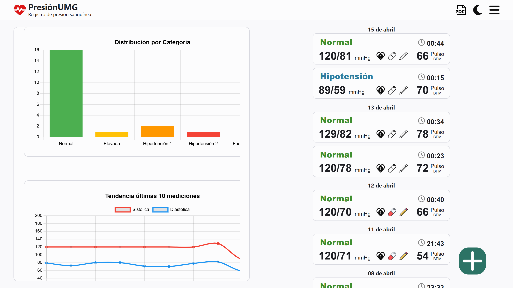

# Instalación

-   cd pressure-control

-   pnpm install

-   pnpm run dev

## Tecnologías

> React, CSS Modules, Typescript, Vite

## Screenshots

### Mobile - Light Theme

    
    
    
    
    
    
    

### Mobile - Dark Theme

    
    
    
    
    
    
    

### Desktop

    
    
    
    

